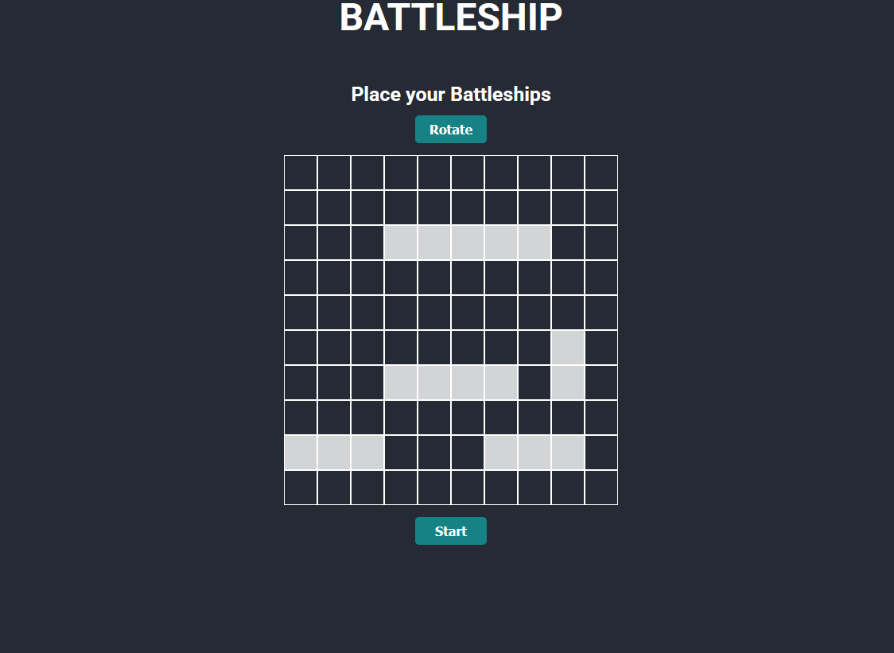
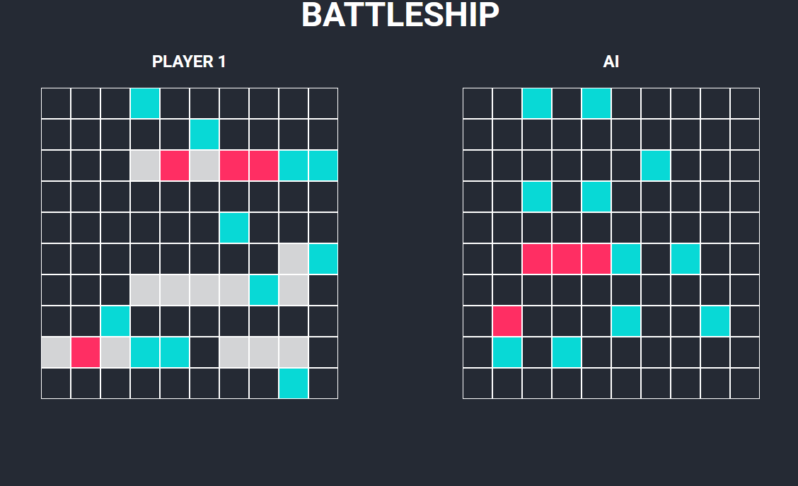

# Battleship
This project demonstrates my ability to create a project using Test Driven Development and is part of my journey through [The Odin Project](https://www.theodinproject.com/). I began the project creating tests for my various objects and then added the code that passed those tests. I also tried my best to write code that has loose coupling. I utilized the [PubSub-js](https://www.npmjs.com/package/pubsub-js) package to help with this. Please feel free to give any advice you may have!

# Live Demo
[Battleship](https://battleship-eight.vercel.app/)

# Local Install
```
git clone https://github.com/ealvara6/battleship.git
cd battleship
npm install
npm start
```
# Preview
### Setup


### Game


# Features
- Object-oriented design for board, ship, and game state management
- Turn-based game flow with win condition handling
- AI opponent logic to simulate player decisions
- Input validation to ensure valid gameplay interactions
- Full test coverage using Jest
